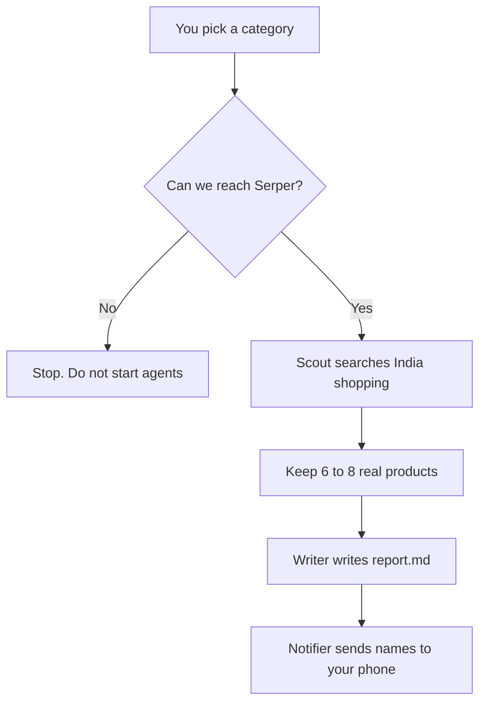

# Shoppiomart Product Finder

A CrewAI project with **3 agents** that work one after another:

1. **Scout** searches Google Shopping (India) and picks real products.
2. **Writer** turns those products into listing copy in `report.md`.
3. **Notifier** sends only the product **names** to your phone with Pushover.

The scout can only use products that Serper actually returns. It does not make up product names. If Serper is down, the run stops before any agent starts.

---

## How it works

You give a category (default: wireless earbuds). Then:



| Who | Job | Tool |
|---|---|---|
| Scout | Find 6–8 products (name, price, site) | Serper Shopping |
| Writer | Write titles, descriptions, bullets | none |
| Notifier | Push the names list | Pushover |

---

## How to run

```
cd shoppiomart_recommender
uv sync
crewai run
```

Python 3.10–3.13. Put this in `.env`:

```
OPENAI_API_KEY=
SERPER_API_KEY=
PUSHOVER_TOKEN=
PUSHOVER_USER=
```

`Serper_API_KEY`, `PUSHOVER_APP_TOKEN`, and `PUSHOVER_USER_KEY` also work.

---

## Proof it ran

**Traces** — one timeline: scout searched → writer wrote → names were sent.


**Phone** — title is `Shoppiomart · {category}`. Body is a numbered list of names only.


---

## What you get

- `report.md` — listing copy plus a Names list at the end
- CrewAI traces of the run
- A Pushover message on your device

---

## Project files

```
src/shioppiomart_recommender/
  crew.py                 the 3 agents and 3 tasks
  main.py                 start the crew; check Serper first
  config/agents.yaml
  config/tasks.yaml
  tools/
    serper_tools.py       Google Shopping search
    pushover_tool.py      send names to the phone
    http.py               HTTP calls with a timeout (so a dead API does not hang)
```
