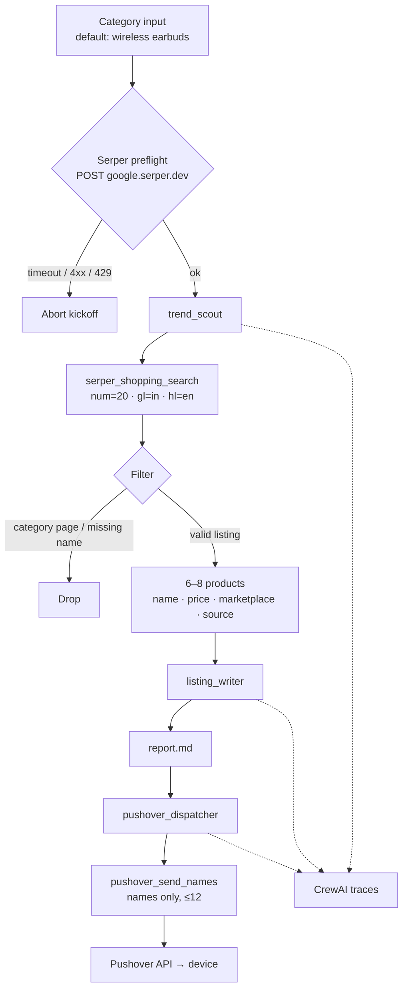

# Shoppiomart Product Finder

Multi-agent CrewAI pipeline that researches live India shopping data, writes catalog copy, and dispatches the product list to Pushover. Tracing is enabled for the full run.

Grounding is tool-first: the scout only keeps products returned by Serper Shopping (`gl=in`). The writer never invents SKUs. If Serper is unreachable, kickoff aborts before any agent starts.

---

## Architecture

Sequential crew, three specialists, custom tools with typed schemas.

| Agent | Task | Tools | Output |
|---|---|---|---|
| India marketplace trend scout | `scout_task` | `serper_shopping_search` | 6–8 grounded products |
| Catalog copywriter | `listing_task` | — | `report.md` (copy + Names list) |
| Pushover dispatcher | `notify_task` | `pushover_send_names` | mobile push |



---

## Run

```
cd shoppiomart_recommender
uv sync
uv run shioppiomart_recommender "wireless earbuds"
```

Requires Python 3.10–3.13.

```
SERPER_API_KEY=
PUSHOVER_TOKEN=
PUSHOVER_USER=
```

Aliases `Serper_API_KEY`, `PUSHOVER_APP_TOKEN`, `PUSHOVER_USER_KEY` are mapped in `main.py`. CrewAI telemetry is disabled; `CREWAI_TRACING_ENABLED` is on.

---

## Trace

Live run of `ShioppiomartRecommender` — scout (`serper_shopping_search`) → writer (`listing_task`) → dispatcher (`pushover_send_names`). Crew output: eight product names pushed for wireless earbuds.


---

## Dispatch

Pushover payload on device. Title is `Shoppiomart · {category}`; body is a numbered names list only.


---

## Artifacts

- `report.md` — listing copy (title, description, bullets, price band, audience) plus a trailing Names block
- CrewAI timeline for the run
- Pushover message (truncated to 1024 chars)

---

## Stack

```
src/shioppiomart_recommender/
  crew.py                 CrewBase · sequential process · tracing
  main.py                 kickoff, train, replay, test, Serper preflight
  config/agents.yaml
  config/tasks.yaml
  tools/
    serper_tools.py       Google Shopping / web search via Serper
    pushover_tool.py      names-only push
    http.py               curl transport, timeouts, HTTP error mapping
```

`http.py` talks to Serper and Pushover over curl (`connect-timeout 8`, `max-time 20`) instead of hanging the crew on a dead socket. Rate limits surface as `429` and stop the run.
