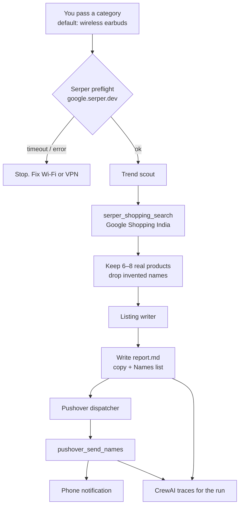

# Shoppiomart Product Finder

This is a small multi-agent crew I built for Shoppiomart. The idea is simple: instead of sitting on Google Shopping and guessing what to list, a crew looks up what is actually selling in India right now, turns that into listing copy, and pings my phone with the product names.

I used CrewAI for the agents, Serper for live shopping data, and Pushover so the result shows up as a real notification. Tracing is on, so you can see every tool call instead of treating the LLM as a black box.

It is not a full catalog system. It is the automation piece — research, write, notify — and it already ran end to end on wireless earbuds.

---

## Why I think this is a solid project

Most “AI shopping” demos invent products. This one is not allowed to. The scout only keeps names that came back from Serper. The writer only writes from that list. Pushover only sends names, not a wall of generated copy.

That constraint is the whole point. If the search API is down, the crew does not start. If a listing has no real name, it gets dropped. The report in `report.md` is from a live run, not a hardcoded sample.

For an employer, this shows:

- a real sequential crew (scout → writer → dispatcher), not one giant prompt
- custom tools with typed inputs, not just “use the search tool”
- production-ish details: env vars, timeouts, tracing, a phone notification you can screenshot
- India-market shopping search (`gl=in`), which is closer to how a store like Shoppiomart would actually use this

---

## How it works

Three agents, three tasks, in order. If Serper is unreachable, the crew never starts — no fake catalog.



1. **Trend scout** — calls Google Shopping India via Serper once, keeps 6–8 distinct products (name, price, marketplace, why it looks hot).
2. **Listing writer** — turns that list into site-ready copy (short title, description, bullets, price band, who it is for) and writes `report.md`.
3. **Pushover dispatcher** — takes the Names list at the bottom of the report and pushes it to my phone.

Default category is `wireless earbuds`. You can pass another category on the command line.

```
python -m shioppiomart_recommender.main
# or
uv run shioppiomart_recommender "wireless earbuds"
```

---

## CrewAI traces

Drop the traces screenshot here (CrewAI dashboard / run timeline). This is the part that shows the crew actually called shopping search, wrote the report, then called Pushover — not a fake happy path.


*(put the image at `assets/traces.png`, or change the path above)*

---

## Phone notification

Drop the Pushover screenshot from my phone here. Title looks like `Shoppiomart · wireless earbuds` with a numbered list of product names.


*(put the image at `assets/notification.png`, or change the path above)*

---

## Setup

Python 3.10–3.13. I used `uv`.

```
cd shoppiomart_recommender
uv sync
```

`.env` needs:

```
SERPER_API_KEY=...
PUSHOVER_TOKEN=...
PUSHOVER_USER=...
```

(older names `Serper_API_KEY`, `PUSHOVER_APP_TOKEN`, `PUSHOVER_USER_KEY` also work)

CrewAI tracing is enabled in `crew.py`. Telemetry is off.

---

## Output

After a successful run you get:

- `report.md` — listing copy plus a plain Names list
- a Pushover notification with those names
- a trace in the CrewAI UI for that run

I left the latest earbuds report in the repo so you can see the writing style without running it.

---

## Layout

```
src/shioppiomart_recommender/
  crew.py              # agents, tasks, tracing
  main.py              # kickoff + Serper preflight
  config/agents.yaml
  config/tasks.yaml
  tools/
    serper_tools.py    # Google Shopping (India)
    pushover_tool.py   # phone ping
    http.py            # curl helpers
```

---

If you are reviewing this as a hiring sample: start with `crew.py` and the two yaml files, then look at the tools. The interesting part is the pipeline, not the package name.
